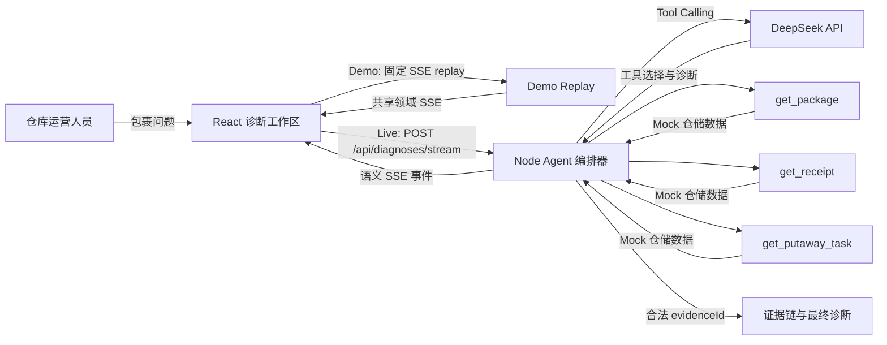
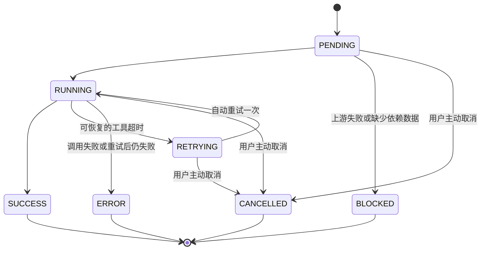

# 入库诊断台

一个可本地运行的仓储异常诊断 Agent Demo。默认选择场景即可播放演示；配置模型后，可输入包含包裹号的问题发起实时诊断。页面优先展示异常原因、处理建议与业务证据，并通过 SSE 呈现完整执行过程。


## Demo / Preview

<p align="center">
  
</p>

[查看原尺寸高清动图](docs/assets/demo-mode.gif) · 场景选择 → 执行过程 → 诊断结论 → 业务证据。

上面的 GIF 展示的是 **Demo Mode**：页面使用模拟数据和固定、确定性的 SSE replay，不调用真实模型、真实仓储 tools 或外部服务。它只是项目展示材料，不是功能正确性的自动化证明。

页面默认进入“演示回放（Demo）”，选择场景后点击“播放演示”，可回放以下三个固定场景：

- `PKG-20260918`：完整成功诊断
- `PKG-404`：数据不足 / 证据不足
- `PKG-TIMEOUT`：工具超时、重试后失败

只有主动切换到 `模型实时诊断（Live）` 后，页面才会运行现有的真实诊断链路，并使用模型和仓储工具。

## 3 分钟体验

### 1. 先体验 Demo Mode（无需模型 Key）

Demo Mode 默认启动，不依赖模型 Key：

```bash
docker compose up --build
```

打开 [http://localhost:5173](http://localhost:5173)，选择默认的“库位不足”场景并点击“播放演示”。

### 2. 如需体验 Live Mode，再配置 DeepSeek

首次配置时复制环境变量模板；已有 `.env` 时直接编辑，避免覆盖原配置：

```bash
cp .env.example .env
```

编辑 `.env`，填入你自己的 DeepSeek Key：

```dotenv
DEEPSEEK_API_KEY=your_deepseek_api_key
DEEPSEEK_BASE_URL=https://api.deepseek.com
DEEPSEEK_MODEL=deepseek-flash
```

真实 Key 不应提交到 Git，也不会被发送到浏览器。修改 `.env` 后，重新创建容器以加载配置：

```bash
docker compose up -d --force-recreate
```

随后切换到“模型实时诊断（Live）”，输入包含一个包裹号的问题并发起诊断。

### 3. 体验三个 Demo 场景

| 包裹号 | 场景 | 预期结果 |
| --- | --- | --- |
| `PKG-20260918` | 完整异常链路 | 收货完成，但入库任务因目标库位容量不足被阻塞 |
| `PKG-404` | 业务空数据 | 包裹查询成功但无记录，下游步骤阻断，证据不足 |
| `PKG-TIMEOUT` | 系统错误 | 入库任务查询超时，自动重试一次后失败 |

## 本地开发

要求 Node.js 22 LTS 或更高版本。

```bash
npm install --legacy-peer-deps
npm run dev
```

开发服务会自动读取项目根目录的 `.env`；修改配置后需重启 `npm run dev`。无需模型配置即可体验 Demo。

- Web：[http://localhost:5173](http://localhost:5173)
- Agent 服务：[http://localhost:8787](http://localhost:8787)
- 健康检查：[http://localhost:8787/api/health](http://localhost:8787/api/health)

## 架构

页面默认通过 `POST /api/demo/diagnoses/stream` 回放固定 Demo fixture；切换到 Live 后，才通过 `POST /api/diagnoses/stream` 进入真实模型、工具和编排链路。



DeepSeek 负责意图识别、下一工具选择、异常分析和最终诊断；Node 编排器负责最大步数、工具参数约束、自动重试、证据完整性和结构化输出校验。模型只能引用代码从 Tool Output 中生成的 `evidenceId`。

## 使用体验

- 演示回放提供“库位不足 / 查无记录 / 查询超时”三个固定场景；模型实时诊断支持输入包含一个包裹号的自然语言问题。两种模式均使用虚构仓储数据，不连接真实 WMS。
- 业务结论和首要处理建议位于执行详情之前；证据按实际条数展示，诊断限制独立列出。
- 修改问题、选择其他场景或切换模式后，旧结果会保留并标注原问题与模式；显式发起下一次运行时才替换。
- 运行中可取消，取消后保留已收到步骤；模式切换需等当前运行结束或取消。
- 查询失败优先展示实际错误步骤及恢复入口。固定超时演示会说明重复播放仍将失败，可选择其他场景。

## Agent 状态



七个稳定业务步骤：

1. 识别问题
2. 查询包裹
3. 查询收货单
4. 查询入库任务
5. 发现异常
6. 生成证据链
7. 最终诊断

查询步骤标记为 `TOOL_CALL`，内部处理步骤标记为 `AGENT_NODE`。每一步展示中文状态、耗时与尝试次数；工具名、原始状态及 Input/Output 默认折叠，可按需展开核验和复制。

## Streaming 协议

服务端不把供应商原始数据包直接暴露给前端，而是发送稳定的领域事件：

```text
trace.started
step.started
tool.call.started
tool.call.completed
step.completed
step.retrying
step.failed
trace.completed
trace.failed
trace.cancelled
```

每条事件包含 `traceId`、单调递增的 `sequence`、`timestamp`、`type` 和 `payload`；步骤事件另带 `stepId`。`trace.started` 还会标记 `mode` 与 `simulated`，用于区分固定回放与实时执行；两种模式的仓储数据均为虚构演示数据。客户端按 `sequence` 幂等地更新状态，并结合 generation/traceId 防止旧运行污染当前 Trace。

## 可靠性与取消

- 运行中显示“取消诊断”。用户取消会立即 abort 当前 Fetch、失效 run generation，并将未完成步骤收敛为 `CANCELLED`；已收到的 Trace 保留。
- SSE 在没有收到 `trace.completed`、`trace.failed` 或 `trace.cancelled` 时提前 EOF，会被识别为异常断流，不会继续停留在 `RUNNING`。
- 客户端连续 30 秒没有领域事件，或整体运行超过 120 秒，会 abort 请求并以明确原因结束。
- Live 服务端对单次模型调用、单次工具调用和整体诊断分别设置 25 秒、10 秒和 110 秒 deadline，并尽量将客户端断开传播到编排器、模型和工具。
- 每次诊断最终只能是 `COMPLETED`、`FAILED` 或 `CANCELLED`。客户端断流、客户端 timeout、模型 timeout、工具 timeout 和整体 deadline 都进入 `FAILED`，并记录结构化终止原因。
- 不使用 SSE heartbeat、独立取消 endpoint、断线续传或自动重试整个诊断。

## 安全与真实性

- DeepSeek Key 只由 Node 服务读取，不进入 Vite 构建参数或浏览器请求。
- Demo Mode 是显式选择的固定 SSE replay，不是 Live 失败后的自动降级；Live 失败时不会自动切换到 Demo。
- Demo fixture 中的工具事件只是模拟调用；只有 Live 模式才会真正执行仓储工具。
- Live 模式使用真实模型和仓储工具，数据为完全虚构的本地演示数据。
- 证据链只能来自成功的 Tool Output。
- 模型返回不存在的证据 ID 时会得到一次纠正机会，再次失败则终止 Trace。
- 页面不展示模型思考过程、完整 Prompt 或 API Key。

## 测试

```bash
npm test
npm run build
```

自动化测试覆盖 HTTP/SSE 边界、前端状态更新与组件呈现，不依赖真实模型：

- 正常诊断的有序事件流和完整证据引用
- 业务空数据与系统故障的语义区分
- 工具超时只自动重试一次
- 非法证据引用被拒绝
- 客户端忽略重复或过期事件
- `BLOCKED` 状态可见且不会被误判为成功
- Demo 三个 fixture 的确定性 SSE replay、模式 metadata 和错误边界
- Demo/Live endpoint 选择、traceId 隔离与旧事件丢弃
- 场景选择、输入校验、历史结果归属、失败步骤定位与取消后的状态
- 结论和建议的展示顺序、实际证据条数、空态提示与默认折叠的技术信息

真实浏览器交互另行验收，包括三个 Demo 场景、取消、切换模式、结果跳转、JSON 复制、键盘操作与窄屏布局；上方 GIF 仅记录其中一条成功演示路径。

## 项目结构

```text
src/        React 页面、组件、SSE 客户端与状态更新
server/     Agent 编排、DeepSeek 适配、Mock 工具、Demo replay 与 API
shared/     前后端共享的事件和诊断协议
docs/       Agent 配置、演示截图与 Demo GIF
```

## 明确的非目标

本 Demo 不接入真实 WMS、数据库、登录权限、多用户并发、Trace 持久化、断线续传、多模型路由或完整移动端设计。它聚焦于一个可审阅、可运行、可追溯的仓储 Agent 诊断链路。
